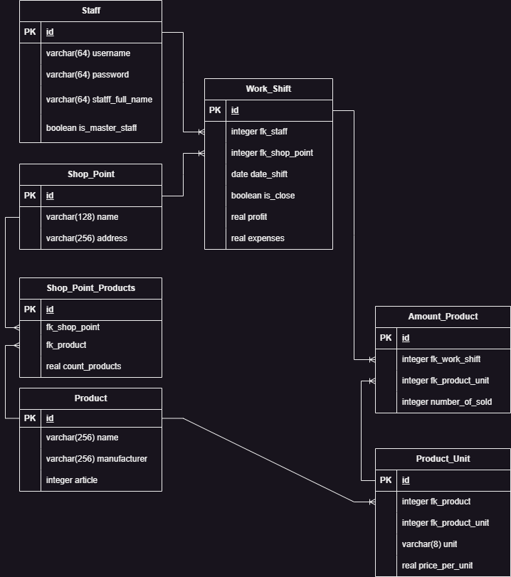

### OTUS DB HW 1
### __Проект базы данных для Индивидуальных предпринимателей__

### Пример использования БД
```
Данная база данных может быть использована
в проектах для решения задач малаго бизнеса (Индивидуальных Предпринимателей).
- Небольшие магазины (8-10 точек по городу).
- Для предпринимателей занимающихся торговлей узкоспециализированного товара (Например корма для рептилий).

То есть это бизнес который имеет малый сбыт в рамках одного города.
Есть сервисы CRM по типу "Мой склад", но не каждый предприниматель готов решиться на покупку подобного сервиса.
При том что большинство из них сами не представляют зачем им это нужно.

Такие предприниматели используют таблицы-Excell как базы данных для своих расчетов. Ведут реальный Гроссбух.

Чаще всего они либо самостоятельно, либо с помощью ответственного человека
ведут учет и редактируют данных.

Однако используя данную БД в сумме с небольшим веб-приложением,
расчитанным на внутренее использование (Только для сотрудников),
у препринимателя появляется ряд полезных навыков,
что в последствии может обеспечить рост прибыли.

Среди них:
- удобное ведение статистики
- автоматический расчет прибыли\расхода по точкам
- безопасное сохранение данных
- статус в совокупности (или по точкам), о необходимости проведения ревизии или внеплановой закупки

```

#### __Сущности__
- Пользователь (User)
- Товары (Products)
- Точки торговли (Shop_Point)
- Смены (Work_Shift)
- Кол-во проданного товара за смену (Amount_Products)


### __Индексы__
- составной индекс в сущности Amount_Products по полям (work_shift_id, product_id). idx_amount_products_work_shift_id_product_id
  Данный запрос имеет высокую кардинальность, так по каждой точке еждневно будут идти запросы в БД. (Как со стороны Предпринимателя так и со стороны сотрудника)
- составной индекс в сущности Work_Shift по полям (user_id, shop_point_id). idx_work_shift_user_id_shop_point_id
  Данный запрос в имеет высокую координальность, так как его выполнение неободимо составления статистики и последующего анализа.


### __Диаграмма__


### __Описание сущностей__
##### Пользователь (User)
- username - тип varchar(64) - __имя пользователя (login сотрудника или владельца предприятия)__
  - Not Null
  - Check != ''
- password - тип varchar(64) - __пароль__
  - Not Null
  - Check != ''
- is_admin - тип boolean - __имеет ли данный пользователь привилегии__
  - Not Null

##### Товары (Products)
- name - тип varchar(256) - __Наименование товара__
  - Not Null
  - Check != ''
- article - тип integer - __Артикул__
  - Not Null
  - Unique
  - Check > 0
- price - тип integer - __Цена__
  - Not Null
  - Unique
  - Check > 0
- manufacturer - тип varchar(256) - __Производитель__

##### Точки торговли (Shop_Point)
- name - тип varchar(128) - __Короткое наименование точки торговли__ (Например На Павелецкой)
  - Check != ''
  - Unique
  - Not Null
- address - тип varchar(256) - __Полный адрес точки торговли__
  - Check != ''
  - Unique
  - Not Null

##### Смены (Work_Shift)
- user_id - тип integer - __Идентификатор сотрудника работающего в эту смену__
  - Not Null
  - FK (User)
- shop_point_id - тип integer - __Идентификатор точки торговли__
  - Not Null
  - FK (Shop_Point)
- date_open - тип date - __Дата открытия смены__
  - Not Null
- is_close - тип boolean - __Закрыта ли смена__
  - Not Null
- profit - тип integer - __Прибыль__
  - Not Null
  - Unique
  - Check > 0
- expenses - тип integer - __Расходы__
  - Not Null
  - Unique
  - Check > 0

##### Кол-во проданного товара за смену (Amount_Products)
- work_shift_id - тип integer - __Идентификатор смены__
  - Not Null
  - FK (Work_Shift)
- product_id - тип integer - __Идентификатор товара__
  - Not Null
  - FK (Product)
- unit - тип varchar(8) - __Единица измерения товара (мешки или кг или граммы)__
  - Not Null
  - Check != ''
- unit_coefficient - тип real  - __Коэффициент для расчета цены__
  - Not Null
  - Check != 0
  - Check <= 1
- count - тип integer - __Кол-во товара проданного товара__
  - Not Null
  - Check > 0
