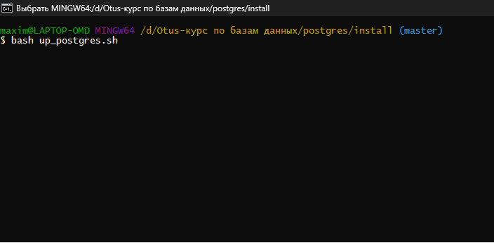
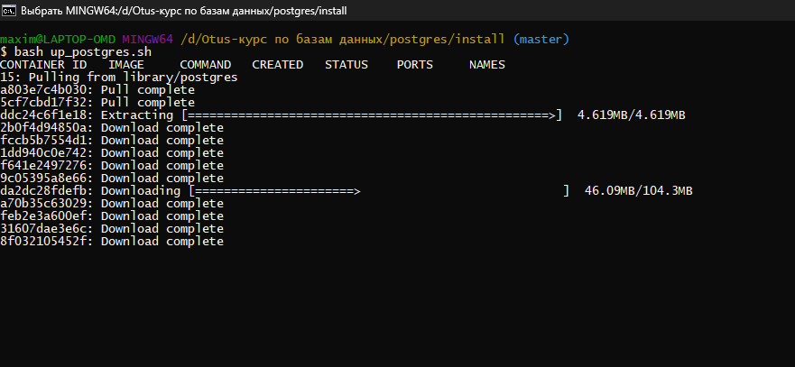
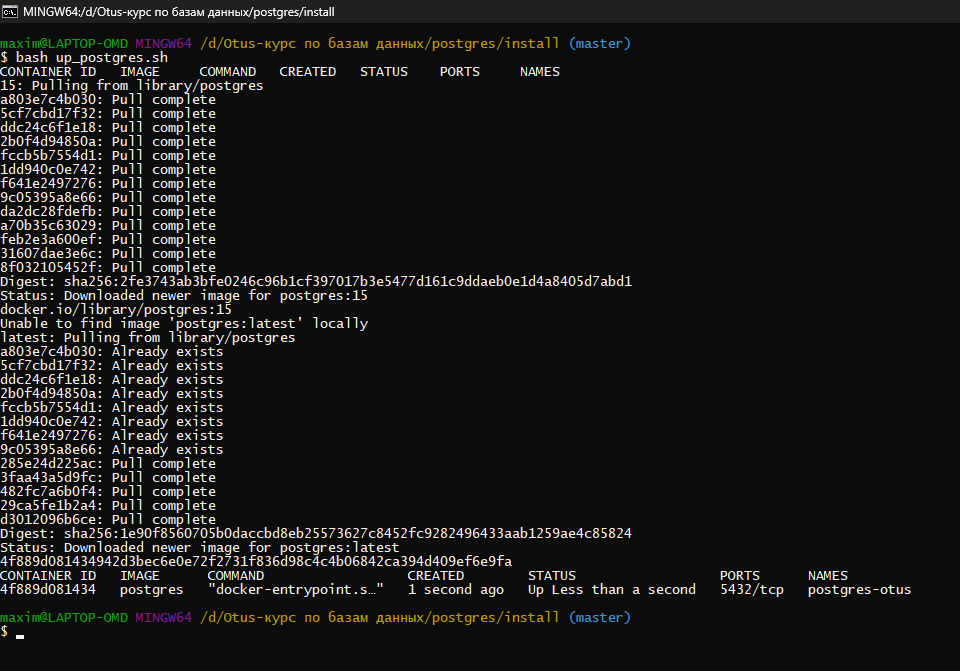
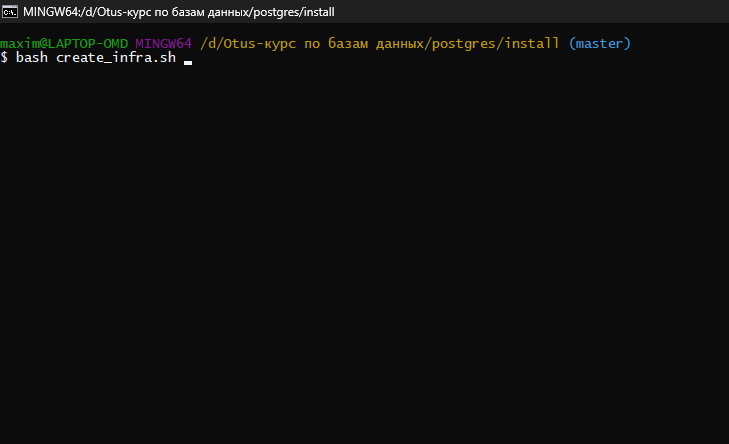
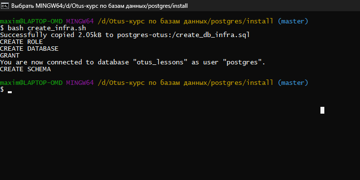
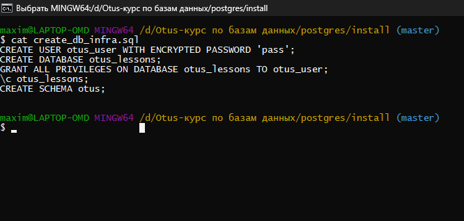
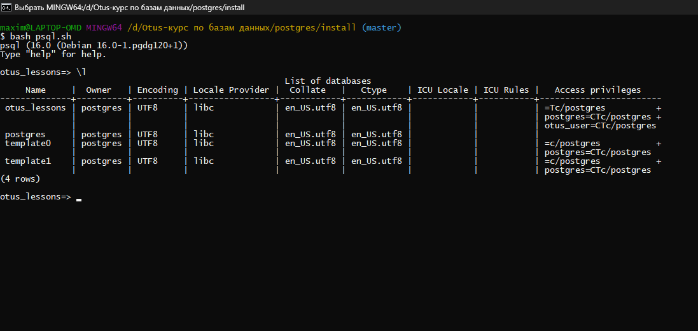

### OTUS DB HW 6

### Установка БД

Предположим что мы находимся в ОС Windows 11 и имеем установленный Docker Desktop.
Нам необохдимо скачать образ Postgres из DockerHub.

- Скачиваем образ и запускаем его.

- Создаем базу данных, схему и пользователя.

- Входим в БД под созданным пользователем в созданную БД

